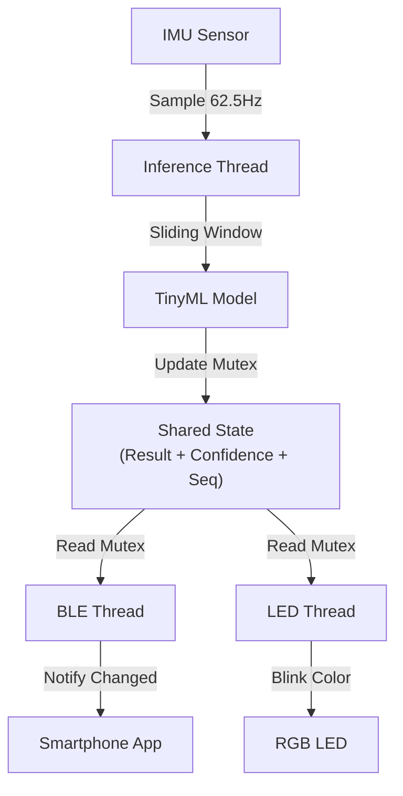

# 🖐️ Embedded Gesture Recognition System (基于 TinyML & RTOS)

> 一个基于 Arduino Nano 33 BLE Sense Rev2 的实时手势识别系统，集成了 Edge Impulse 机器学习模型、FreeRTOS 多线程调度以及 BLE 蓝牙低功耗通信。


## 📖 项目简介 (Introduction)

本项目是嵌入式系统毕业设计的一部分。目标是构建一个低功耗、可穿戴的手势交互终端。系统利用板载 IMU (BMI270) 采集运动数据，通过部署在边缘端的神经网络模型（基于 Edge Impulse）实时识别手势，并通过 BLE 蓝牙协议将结果广播给上位机（手机/电脑），实现对外部设备的无线控制。

### ✨ 核心特性 (Key Features)

* **⚡ 模块化架构 (Modular Design)**: 采用高内聚低耦合设计，将推理 (`Inference`)、通信 (`BLE`) 和交互 (`LED`) 拆分为独立模块。
* **🔄 实时操作系统 (RTOS)**: 基于 Mbed OS 的多线程设计。
    * **Inference Thread**: 负责传感器采样与模型推理（高优先级）。
    * **BLE Thread**: 负责蓝牙广播与数据推送（IO 密集型）。
    * **LED Thread**: 负责状态指示（非阻塞延时）。
* **🛡️ 线程安全 (Thread Safety)**: 使用 `rtos::Mutex` 保护共享的预测结果，防止多任务环境下的竞争条件 (Race Condition)。
* **📡 事件驱动通信**: 引入序列号 (`Sequence ID`) 机制，仅在检测到新手势时触发 BLE 通知，大幅降低无效广播功耗。
* **🧠 边缘计算**: 模型完全在微控制器上运行，无需联网即可完成推理。

## 🛠️ 硬件要求 (Hardware)

* **开发板**: Arduino Nano 33 BLE Sense **Rev2**
    * *注意：Rev2 版本使用 BMI270/BMM150 传感器，与旧版 LSM9DS1 不通用。*
* **传感器**: 板载 6轴 IMU (加速度计 + 陀螺仪)
* **连接**: Micro-USB 数据线

## ⚙️ 软件依赖 (Dependencies)

在 Arduino IDE 中需安装以下库：

1.  **Arduino_BMI270_BMM150**: 用于驱动 Rev2 的 IMU 传感器。
2.  **ArduinoBLE**: 用于蓝牙低功耗通信。
3.  **Edge Impulse Library**: 导出的 C++ 模型库 (本名为 `a5-deminsion_inferencing`)。

## 🏗️ 系统架构 (System Architecture)

系统由三个核心线程并发运行，通过全局受保护状态进行通信：



## 📁 项目结构 (Project Structure)

```
├── src/                    # 嵌入式固件源码
│   ├── main.cpp           # 主程序入口
│   ├── inference_module.cpp  # AI推理模块
│   ├── ble_module.cpp     # BLE通信模块
│   └── led_module.cpp     # LED控制模块
├── include/               # 头文件
├── lib/                   # Edge Impulse 模型库
├── pc_controller/         # PC端上位机程序 ⭐
│   ├── main.py           # 主程序入口
│   ├── ble_manager.py    # BLE连接管理
│   ├── gesture_handler.py # 手势处理与快捷键执行
│   ├── config_manager.py # 配置管理
│   ├── gui.py            # 图形界面
│   └── tests/            # 单元测试
└── platformio.ini        # PlatformIO配置
```

---

## 🖥️ PC Controller 上位机程序

PC Controller 是一个 Windows 桌面应用，通过 BLE 接收开发板的手势识别结果，并将手势转换为自定义键盘快捷键，可用于控制 PPT 翻页、媒体播放等。

### ✨ 功能特性

- **BLE 无线连接**: 自动扫描并连接 "5ClassForwarder" 设备
- **自定义快捷键**: 每个手势可绑定任意键盘组合键
- **中英文界面**: 支持一键切换界面语言
- **冷却时间**: 防止手势重复触发
- **自动重连**: 断开后自动尝试重新连接

### 📦 安装依赖

```bash
cd pc_controller
pip install -r requirements.txt
```

或手动安装：
```bash
pip install bleak pynput
```

### 🚀 运行程序

```bash
cd pc_controller
python main.py
```

### 📖 使用说明

1. **连接设备**
   - 确保开发板已上电并运行固件
   - 点击 "Auto Connect" 自动扫描并连接
   - 或点击 "Scan" 手动扫描，选择设备后点击 "Connect"

2. **配置快捷键**
   - 在 "Gesture → Shortcut Mapping" 区域设置每个手势对应的快捷键
   - 快捷键格式示例：
     - 单键: `right`, `left`, `up`, `down`, `space`, `enter`, `f5`
     - 带修饰键: `ctrl+right`, `alt+tab`, `shift+f5`
     - 多修饰键: `ctrl+shift+s`
     - 禁用: `none`
   - 点击 "Save Settings" 保存配置

3. **默认配置**
   | 手势 | 默认快捷键 | 用途 |
   |------|-----------|------|
   | 向左 | `right` (→) | PPT 下一页 |
   | 向右 | `left` (←) | PPT 上一页 |
   | 向上 | `none` | 未配置 |
   | 向下 | `none` | 未配置 |

4. **调整参数**
   - **Confidence Threshold**: 置信度阈值 (0.5-1.0)，低于此值的手势不触发
   - **Cooldown**: 冷却时间 (0.5-5.0秒)，防止连续触发

### 🔧 常见问题

**Q: 扫描不到设备？**
- 确保 Windows 蓝牙已开启
- 确保开发板正在运行并广播
- 尝试使用 "Auto Connect" 功能

**Q: 一次手势翻了多页？**
- 增加 Cooldown 时间到 2-3 秒

---

## 🔧 编译与烧录 (Build & Flash)

本项目使用 PlatformIO 进行构建：

```bash
# 编译
pio run

# 烧录
pio run --target upload

# 串口监视器
pio device monitor
```

## 📜 许可证 (License)

MIT License
