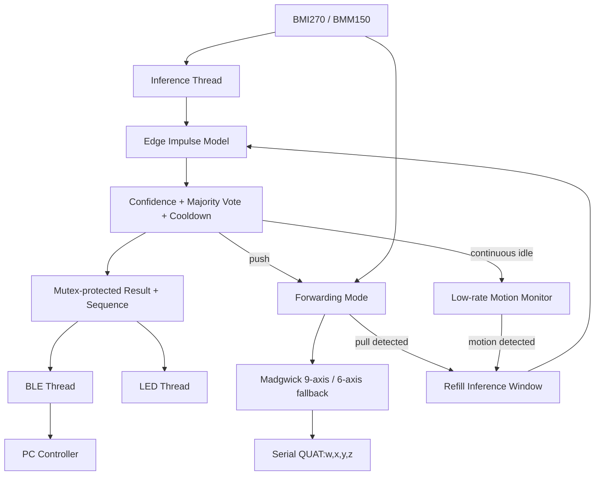

# 5Class Data Forwarder

> 基于 Arduino Nano 33 BLE Sense Rev2、Edge Impulse TinyML 与 Mbed OS RTOS 的实时手势识别和姿态数据转发系统。


## 项目简介

本项目面向可穿戴手势交互场景，在 Arduino Nano 33 BLE Sense Rev2 上完成 IMU 数据采集、TinyML 手势分类、结果去抖、BLE 通知和姿态解算。

系统具有两条主要数据链路：

1. **手势识别链路**：采集三轴加速度，运行 Edge Impulse 模型，对结果进行置信度过滤和多数投票，再通过 BLE 向 PC 上位机发送已确认的手势。
2. **姿态转发链路**：识别到 `push` 后进入姿态转发模式，融合加速度计、陀螺仪和可用的磁力计数据，持续通过串口输出四元数；检测到明显拉回动作后返回手势识别模式。

项目还包含一个 Python PC Controller，可通过 BLE 接收方向手势并映射为键盘快捷键。

## 当前功能

- 识别 `up`、`down`、`left`、`right`、`push` 和 `idle` 六个类别。
- 使用 48 Hz 三轴加速度数据运行整型量化 Edge Impulse 模型。
- 使用滑动窗口提高连续识别响应速度。
- 使用 5 次窗口、3 票确认和最低 0.65 置信度过滤误识别。
- 非 `idle` 手势确认后启用 1.2 秒固件冷却。
- 通过结果序列号保证 BLE 和 LED 只处理新的确认结果。
- 识别 `push` 后启用 Madgwick 四元数姿态解算。
- 磁力计有效时运行 9 轴融合，无效时自动回退到 6 轴融合。
- 根据加速度模长动态调整 Madgwick `beta`，降低剧烈运动时的加速度干扰。
- 长时间识别为 `idle` 后进入低频运动监测状态，并在检测到运动后重新填充推理窗口。
- RGB LED 显示手势、姿态转发和空闲状态。
- BLE 上位机支持扫描、自动连接、自定义快捷键、中英文界面和二次冷却。

## 硬件与传感器

### 必需硬件

- Arduino Nano 33 BLE Sense **Rev2**
- Micro-USB 数据线
- 支持 BLE 的 Windows PC（如需使用 PC Controller）

### 板载传感器

本项目使用 `Arduino_BMI270_BMM150` 库访问：

- **BMI270 加速度计**：手势模型输入、运动检测和姿态重力参考。
- **BMI270 陀螺仪**：姿态角速度输入。
- **BMM150 磁力计**：可用时提供航向参考。

> Rev2 使用 BMI270/BMM150，不能直接替换为面向旧版 Nano 33 BLE Sense 的 LSM9DS1 驱动。

## 软件栈

- PlatformIO
- Arduino framework
- Arduino Mbed OS / `rtos::Thread` / `rtos::Mutex`
- `Arduino_BMI270_BMM150`
- `ArduinoBLE`
- Edge Impulse C++ inference SDK
- Python 3、Bleak、Pynput（PC Controller）

固件依赖已在 `platformio.ini` 中声明，PlatformIO 会在首次构建时自动解析。

## 系统架构


```mermaid
flowchart TD
    IMU["BMI270 / BMM150"] --> INF["Inference Thread"]
    INF --> MODEL["Edge Impulse Model"]
    MODEL --> FILTER["Confidence + Majority Vote + Cooldown"]
    FILTER --> SHARED["Mutex-protected Result + Sequence"]
    SHARED --> BLE["BLE Thread"]
    SHARED --> LED["LED Thread"]
    BLE --> PC["PC Controller"]

    FILTER -->|push| ATT["Forwarding Mode"]
    IMU --> ATT
    ATT --> MADGWICK["Madgwick 9-axis / 6-axis fallback"]
    MADGWICK --> SERIAL["Serial QUAT:w,x,y,z"]
    ATT -->|pull detected| REFILL["Refill Inference Window"]
    REFILL --> MODEL

    FILTER -->|continuous idle| IDLE["Low-rate Motion Monitor"]
    IDLE -->|motion detected| REFILL
```

### RTOS 线程

| 线程 | 默认优先级 | 主要职责 |
|---|---:|---|
| `inferenceThread` | Normal | IMU 采样、模型推理、状态机、姿态解算；栈大小 8192 B |
| `bleThread` | Normal | BLE 连接维护和新结果通知 |
| `ledThread` | Normal | RGB LED 状态显示 |

共享预测结果由 `rtos::Mutex` 保护。每次确认结果时递增 `g_result_sequence`，消费者通过比较序列号判断是否出现新事件，避免重复发送或重复闪灯。

## 推理模型

当前仓库包含 Edge Impulse 项目 `5-deminsion` 的部署版本 20，编译模型图编号为 `43`。

| 参数 | 当前值 |
|---|---:|
| 输入 | 三轴加速度 `x, y, z` |
| 类别 | `down`, `idle`, `left`, `push`, `right`, `up` |
| 采样频率 | 48 Hz |
| 单窗口原始样本数 | 24 |
| DSP 输入长度 | 72 个浮点值（24 × 3） |
| 窗口时长 | 约 500 ms |
| 滑动步长 | 2 个样本 / 6 个轴数据点 |
| 理论窗口推进间隔 | 约 41.7 ms，不含推理耗时 |
| 模型输入/输出 | INT8 量化 |

模型文件位于：

```text
lib/a5-deminsion_inferencing/
├── src/model-parameters/model_metadata.h
├── src/model-parameters/model_variables.h
└── src/tflite-model/tflite_learn_792000_43_compiled.*
```

替换模型时必须同时替换整个 Edge Impulse 导出库，不能只替换 `.cpp` 模型数组，否则元数据、类别顺序、DSP 配置和模型符号可能不匹配。

## 手势确认流程

```text
48 Hz 加速度采样
      ↓
500 ms 滑动窗口
      ↓
Edge Impulse 原始分类
      ↓
置信度 >= 0.65？ ──否──> 忽略
      ↓ 是
写入最近 5 次投票窗口
      ↓
同一类别至少 3 票？ ──否──> 等待下一次结果
      ↓ 是
确认结果 + sequence 自增
      ↓
非 idle 类别进入 1200 ms 冷却
```

### 当前关键参数

参数集中在 `src/inference_module.cpp`：

| 参数 | 默认值 | 作用 |
|---|---:|---|
| `SLIDING_WINDOW_STEP` | 6 | 每轮加入 2 组三轴加速度样本 |
| `VOTE_WINDOW_SIZE` | 5 | 最近原始分类结果数量 |
| `VOTE_THRESHOLD` | 3 | 确认类别所需票数 |
| `MIN_CONFIDENCE` | 0.65 | 参与投票的最低置信度 |
| `COOLDOWN_MS` | 1200 ms | 非 `idle` 手势确认后的冷却时间 |
| `PULL_THRESHOLD` | 2.5 g | 退出姿态转发模式的加速度模长阈值 |
| `IDLE_TRIGGER_COUNT` | 60 | 进入空闲监测前的已确认 `idle` 次数 |
| `IDLE_SAMPLE_INTERVAL_MS` | 150 ms | 空闲状态运动检测间隔 |
| `MOTION_THRESHOLD_G` | 0.5 g | 相邻加速度模长变化唤醒阈值 |
| `MOTION_CONFIRM_COUNT` | 1 | 唤醒所需连续运动次数 |

`idle` 不启动冷却，因此可连续累计并进入空闲状态；任何非 `idle` 确认结果都会重置空闲计数。

## 姿态解算与转发

### 状态切换

姿态功能不是一直运行，而是由手势状态机控制：

```text
INFERENCE_MODE
  ├─ 已确认 push ───────────────> FORWARDING_MODE
  └─ 连续 idle 达到阈值 ───────> IDLE_STATE

FORWARDING_MODE
  └─ |acceleration| > 2.5 g ───> REFILLING_MODE

IDLE_STATE
  └─ 加速度模长变化 > 0.5 g ───> REFILLING_MODE

REFILLING_MODE
  └─ 重新采集完整模型窗口 ─────> INFERENCE_MODE
```

重新填充完整窗口可以避免姿态转发或休眠期间的旧数据直接进入模型，降低状态切换后的边界误识别。

### Madgwick 输入处理

`include/MadgwickFilter.h` 提供两种更新路径：

- `update(...)`：融合陀螺仪、加速度计和磁力计的 9 轴更新。
- `updateIMU(...)`：只融合陀螺仪和加速度计的 6 轴更新。

运行时流程如下：

1. 读取加速度计和陀螺仪。
2. 尝试读取磁力计，并排除读取失败及 `-32768` 异常值。
3. 将陀螺仪从度每秒转换为弧度每秒。
4. 对 `gx`、`gy` 取反，使传感器坐标方向与当前姿态坐标约定一致。
5. 当加速度模长处于 `0.8–1.2 g` 时使用 `beta = 0.05` 修正漂移。
6. 剧烈运动时使用 `beta = 0`，暂时依赖陀螺仪积分，避免线性加速度被误认为重力。
7. 磁力计有效时运行 9 轴融合，否则自动运行 6 轴融合。

### 四元数串口协议

姿态结果以归一化四元数输出：

```text
QUAT:w,x,y,z
```

示例：

```text
QUAT:0.9987,-0.0152,0.0418,0.0231
```

字段顺序对应 `q0, q1, q2, q3`，即标量分量 `w` 在前。姿态转发循环目标间隔为 20 ms。

> 当前四元数只输出到 USB 串口，不通过现有 BLE 特征发送。BLE 仍用于已确认的手势标签和置信度。

### 使用注意事项

- 9 轴航向精度依赖磁力计校准和周围磁环境；当前代码未实现硬铁/软铁在线标定。
- 6 轴回退可以稳定估计俯仰和横滚，但绝对航向会随陀螺仪漂移。
- 四元数是姿态表示，不是欧拉角；上位机需要自行转换为 roll、pitch、yaw 或旋转矩阵。
- `beta = 0` 是运动期间的抗干扰策略，长时间持续运动仍可能积累积分漂移。

## BLE 协议

### 设备信息

| 项目 | 值 |
|---|---|
| 设备名 | `5ClassForwarder` |
| Service UUID | `19B10010-E8F2-537E-4F6C-D104768A1214` |
| Prediction UUID | `19B10011-E8F2-537E-4F6C-D104768A1214` |
| Confidence UUID | `19B10012-E8F2-537E-4F6C-D104768A1214` |

`Prediction` 是最长 32 字节的可读/通知字符串，`Confidence` 是可读/通知浮点数。BLE 线程每 100 ms 轮询一次，只在以下条件同时满足时发布：

- 序列号非零且与上次发布不同；
- 预测索引有效；
- 置信度不低于 0.55。

由于进入共享结果前已经经过 0.65 的投票门槛，正常确认手势会满足 BLE 的 0.55 发送门槛。

## LED 状态

Nano 33 BLE Sense Rev2 的板载 RGB LED 为低电平点亮。

| 状态/手势 | LED 行为 |
|---|---|
| `up` | 绿色，约 500 ms |
| `down` | 黄色，约 500 ms |
| `right` | 紫色，约 500 ms |
| `left` | 蓝色，约 500 ms |
| `push` / 姿态转发 | 白色常亮 |
| `idle` | 红色 |
| 长时间无新结果/空闲监测 | 熄灭 |

## 项目结构

```text
.
├── include/
│   ├── MadgwickFilter.h       # 6/9 轴 Madgwick 四元数滤波器
│   ├── inference_module.h     # 推理模块接口
│   ├── ble_module.h           # BLE 模块接口
│   └── led_module.h           # LED 模块接口
├── src/
│   ├── main.cpp               # 初始化与 RTOS 线程启动
│   ├── inference_module.cpp   # 推理、投票、状态机、姿态解算
│   ├── ble_module.cpp         # BLE 服务与事件发布
│   └── led_module.cpp         # RGB LED 状态反馈
├── lib/
│   └── a5-deminsion_inferencing/ # Edge Impulse 模型与 SDK
├── pc_controller/
│   ├── main.py                # PC 程序入口
│   ├── ble_manager.py         # BLE 扫描、连接和通知处理
│   ├── gesture_handler.py     # 手势到快捷键映射
│   ├── config_manager.py      # 配置持久化
│   ├── gui.py                 # Tkinter GUI
│   └── tests/                 # Python 测试
├── docs/                      # 投票机制、快速参考和变更记录
├── platformio.ini             # PlatformIO 环境配置
└── README.md
```

## 构建与烧录

### 环境准备

1. 安装 [Visual Studio Code](https://code.visualstudio.com/) 和 PlatformIO IDE 扩展，或安装 PlatformIO Core。
2. 克隆并进入项目目录。
3. 使用 USB 连接 Arduino Nano 33 BLE Sense Rev2。

### 常用命令

```bash
# 编译固件
pio run

# 上传固件
pio run --target upload

# 打开 115200 baud 串口监视器
pio device monitor

# 清理构建产物
pio run --target clean
```

上传失败时，快速双击开发板复位键进入 bootloader，再重新执行上传命令。

## PC Controller

### 安装

```bash
cd pc_controller
python -m pip install -r requirements.txt
```

### 运行

```bash
python main.py
```

也可从仓库根目录运行：

```bash
python pc_controller/main.py
```

### 默认配置

| 手势 | 默认快捷键 | 默认用途 |
|---|---|---|
| `left` | `right` | 下一页 |
| `right` | `left` | 上一页 |
| `up` | `none` | 不执行 |
| `down` | `none` | 不执行 |

PC Controller 默认置信度阈值为 0.70，默认动作冷却为 2.0 秒。支持 `ctrl+right`、`alt+tab`、`shift+f5` 等组合键；设为 `none` 可禁用某个方向手势。

`push` 用于固件状态切换，`idle` 用于空闲判断，因此不属于 PC Controller 的可配置快捷键集合。

### 运行测试

```bash
python -m pytest pc_controller/tests
```

## 串口调试输出

典型手势识别输出：

```text
[Inference] Raw: left (0.75)
[Vote] ✓ Confirmed: left (votes: 3/5)
[Cooldown] Started (1200 ms)
[Inference] >>> CONFIRMED: left (seq=42) <<<
[BLE] Published seq=42: left (0.750)
```

进入姿态转发后的输出：

```text
>>> !!! PUSH DETECTED !!! Switching to FORWARDING_MODE <<<
QUAT:0.9998,-0.0041,0.0172,0.0085
QUAT:0.9996,-0.0068,0.0249,0.0117
>>> Pull detected (Mag: 2.71)! Returning to INFERENCE_MODE <<<
>>> Refilling Inference Window... <<<
>>> State: INFERENCE_MODE <<<
```

空闲与唤醒输出：

```text
>>> Entering IDLE_STATE (low power mode). Baseline: 1.00 g <<<
IDLE: monitoring motion...
IDLE: Motion detected (delta: 0.63g, count: 1/1)
>>> Exiting IDLE_STATE, waking up system <<<
```

## 参数调优建议

- **误触发较多**：提高 `MIN_CONFIDENCE` 或 `VOTE_THRESHOLD`。
- **识别响应太慢**：降低 `VOTE_WINDOW_SIZE`/`VOTE_THRESHOLD`，但会牺牲稳定性。
- **同一动作重复触发**：增大固件 `COOLDOWN_MS` 或 PC Controller 冷却时间。
- **难以退出姿态模式**：适当降低 `PULL_THRESHOLD`，并结合实际佩戴方向测试。
- **空闲状态容易误唤醒**：增大 `MOTION_THRESHOLD_G` 或 `MOTION_CONFIRM_COUNT`。
- **空闲状态不易唤醒**：减小 `MOTION_THRESHOLD_G`，但可能增加误唤醒。
- **姿态抖动明显**：检查传感器安装是否牢固，并针对设备动态调整静止时的 `beta`。
- **航向漂移**：确认磁力计数据有效并增加磁力计校准；仅使用 6 轴时无法消除绝对航向漂移。

修改投票窗口大小时应注意：`counts` 数组按模型的 `EI_CLASSIFIER_LABEL_COUNT` 分配，因此替换模型后需确认类别数和标签名称仍符合状态机及 PC Controller 的约定。

## 常见问题

### 编译时找不到 IMU 库

确认 `platformio.ini` 使用 `board = nano33ble`，并执行：

```bash
pio run --target clean
pio run
```

### BLE 扫描不到设备

- 确认串口出现 `[BLE] Advertising started`。
- 确认 Windows 蓝牙已开启且没有其他程序占用连接。
- 尝试重启开发板、重新打开 PC Controller 或删除系统中的旧配对记录。
- 确认设备名仍为 `5ClassForwarder`，UUID 与固件一致。

### 有手势输出但 PC 不执行快捷键

- 确认手势属于 `left/right/up/down`。
- 检查 PC Controller 的置信度阈值和冷却时间。
- 检查该手势是否映射为 `none`。
- 某些以管理员权限运行的软件可能不会接受普通权限进程注入的按键。

### 姿态模式没有磁力计融合

代码会在磁力计不可用、读取失败或出现异常值时自动回退到 6 轴模式。检查 BMM150、周围磁干扰和传感器驱动；需要精确航向时还应增加磁力计校准。

### 串口没有 `QUAT` 数据

必须先由模型确认 `push` 并进入 `FORWARDING_MODE`。确认串口中出现状态切换日志，并检查加速度计和陀螺仪是否都能读取。

## 相关文档

- [投票与冷却机制](docs/voting_mechanism.md)
- [快速参考](docs/quick_reference.md)
- [变更记录](docs/CHANGELOG.md)

## License

本项目采用 [MIT License](LICENSE)。Edge Impulse 导出 SDK 及其第三方组件遵循各自目录中声明的许可证。

## 致谢

- [Arduino](https://www.arduino.cc/)
- [Edge Impulse](https://edgeimpulse.com/)
- [PlatformIO](https://platformio.org/)
- [Madgwick orientation filter](https://x-io.co.uk/open-source-imu-and-ahrs-algorithms/)
