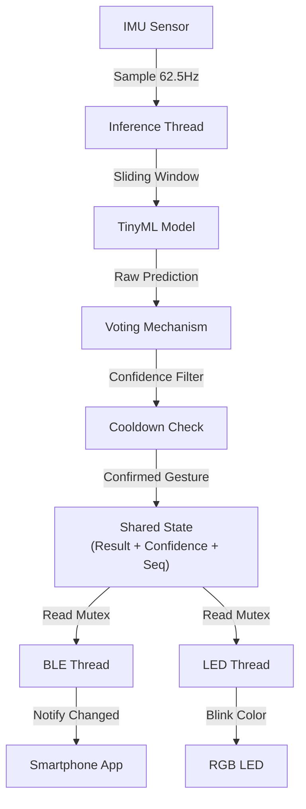

# 🖐️ Embedded Gesture Recognition System (基于 TinyML & RTOS)

> 一个基于 Arduino Nano 33 BLE Sense Rev2 的实时手势识别系统，集成了 Edge Impulse 机器学习模型、FreeRTOS 多线程调度以及 BLE 蓝牙低功耗通信。


## 📖 项目简介 (Introduction)

本项目是嵌入式系统毕业设计的一部分。目标是构建一个低功耗、可穿戴的手势交互终端。系统利用板载 IMU (BMI270) 采集运动数据，通过部署在边缘端的神经网络模型（基于 Edge Impulse）实时识别手势，并通过 BLE 蓝牙协议将结果广播给上位机（手机/电脑），实现对外部设备的无线控制。

### ✨ 核心特性 (Key Features)

* **⚡ 模块化架构 (Modular Design)**: 采用高内聚低耦合设计，将推理 (`Inference`)、通信 (`BLE`) 和交互 (`LED`) 拆分为独立模块。
* **🔄 实时操作系统 (RTOS)**: 基于 Mbed OS 的多线程设计。
    * **Inference Thread**: 负责传感器采样与模型推理（高优先级）。
    * **BLE Thread**: 负责蓝牙广播与数据推送（IO 密集型）。
    * **LED Thread**: 负责状态指示（非阻塞延时）。
* **🛡️ 线程安全 (Thread Safety)**: 使用 `rtos::Mutex` 保护共享的预测结果，防止多任务环境下的竞争条件 (Race Condition)。
* **🎯 智能手势确认 (Intelligent Gesture Confirmation)**: 
    * **多数投票机制**: 连续 5 次推理中至少 3 次相同才确认手势，有效过滤滑动窗口边界误识别。
    * **置信度过滤**: 只有置信度 ≥ 0.65 的预测才参与投票，提高识别准确率。
    * **冷却机制**: 确认手势后进入 1.2 秒冷却期，防止连续误触发和手势完成后的误识别。
* **📡 事件驱动通信**: 引入序列号 (`Sequence ID`) 机制，仅在检测到新手势时触发 BLE 通知，大幅降低无效广播功耗。
* **🧠 边缘计算**: 模型完全在微控制器上运行，无需联网即可完成推理。

## 🛠️ 硬件要求 (Hardware)

* **开发板**: Arduino Nano 33 BLE Sense **Rev2**
    * *注意：Rev2 版本使用 BMI270/BMM150 传感器，与旧版 LSM9DS1 不通用。*
* **传感器**: 板载 6轴 IMU (加速度计 + 陀螺仪)
* **连接**: Micro-USB 数据线

## ⚙️ 软件依赖 (Dependencies)

在 Arduino IDE 中需安装以下库：

1.  **Arduino_BMI270_BMM150**: 用于驱动 Rev2 的 IMU 传感器。
2.  **ArduinoBLE**: 用于蓝牙低功耗通信。
3.  **Edge Impulse Library**: 导出的 C++ 模型库 (本名为 `a5-deminsion_inferencing`)。

## 🏗️ 系统架构 (System Architecture)

系统由三个核心线程并发运行，通过全局受保护状态进行通信：


```mermaid
graph TD
    IMU[IMU Sensor] -->|Sample 62.5Hz| INF_T[Inference Thread]
    INF_T -->|Sliding Window| MODEL[TinyML Model]
    MODEL -->|Raw Prediction| VOTE[Voting Mechanism]
    VOTE -->|Confidence Filter| COOL[Cooldown Check]
    COOL -->|Confirmed Gesture| STATE["Shared State<br/>(Result + Confidence + Seq)"]
    
    STATE -->|Read Mutex| BLE_T[BLE Thread]
    STATE -->|Read Mutex| LED_T[LED Thread]
    
    BLE_T -->|Notify Changed| PHONE[Smartphone App]
    LED_T -->|Blink Color| RGB[RGB LED]
```

### 🎯 手势识别流程 (Gesture Recognition Pipeline)

```
原始推理 → 置信度过滤 (≥0.65) → 投票缓冲区 (5次) → 多数投票 (≥3票) → 确认手势 → 冷却期 (1.2s)
   ↓            ↓                    ↓                  ↓              ↓            ↓
 每次推理    低置信度忽略        记录最近5次        统计票数      更新状态    忽略所有推理
```

**关键机制说明**：
- **投票窗口**: 维护最近 5 次推理结果
- **投票阈值**: 至少 3 次相同才确认（60% 一致性）
- **置信度阈值**: 0.65（低于此值不参与投票）
- **冷却时间**: 1.2 秒（手势间最小间隔）
- **特殊处理**: idle 状态不触发冷却，允许快速过渡

## 📁 项目结构 (Project Structure)

```
├── src/                    # 嵌入式固件源码
│   ├── main.cpp           # 主程序入口
│   ├── inference_module.cpp  # AI推理模块（含投票+冷却机制）
│   ├── ble_module.cpp     # BLE通信模块
│   └── led_module.cpp     # LED控制模块
├── include/               # 头文件
├── lib/                   # Edge Impulse 模型库
├── docs/                  # 📚 文档目录
│   ├── voting_mechanism.md   # 投票+冷却机制详细说明
│   ├── quick_reference.md    # 快速参考手册
│   └── CHANGELOG.md          # 改进日志
├── pc_controller/         # PC端上位机程序 ⭐
│   ├── main.py           # 主程序入口
│   ├── ble_manager.py    # BLE连接管理
│   ├── gesture_handler.py # 手势处理与快捷键执行
│   ├── config_manager.py # 配置管理
│   ├── gui.py            # 图形界面
│   └── tests/            # 单元测试
└── platformio.ini        # PlatformIO配置
```

---

## 🎯 手势识别优化 (Gesture Recognition Optimization)

### 问题与解决方案

在使用滑动窗口进行实时手势识别时，容易在以下时刻产生误识别：
- **手势开始时**: 窗口前半部分是旧数据（idle 或其他手势）
- **手势结束时**: 窗口后半部分是新动作数据
- **手势完成后**: 手臂回到静止位置时产生额外的加速度变化

为了解决这些问题，系统实现了**三重保护机制**：

### 1️⃣ 多数投票机制 (Majority Voting)

只有当一个手势在连续多次推理中稳定出现时，才确认为有效手势。

```cpp
// 配置参数 (src/inference_module.cpp)
#define VOTE_WINDOW_SIZE 5      // 投票窗口：最近5次推理
#define VOTE_THRESHOLD 3        // 投票阈值：至少3次相同
```

**工作原理**：
- 维护最近 5 次推理结果的缓冲区
- 统计每个手势类别的出现次数
- 只有获得至少 3 票的手势才被确认

**效果**：有效过滤滑动窗口边界的瞬时误识别

### 2️⃣ 置信度过滤 (Confidence Filtering)

只有高质量的推理结果才参与投票。

```cpp
#define MIN_CONFIDENCE 0.65f    // 最低置信度阈值
```

**工作原理**：
- 每次推理后检查置信度
- 低于 0.65 的预测直接忽略，不参与投票
- 提高整体识别准确率

**效果**：过滤低质量的推理结果和噪声

### 3️⃣ 冷却机制 (Cooldown Mechanism)

确认手势后进入冷却期，防止连续误触发。

```cpp
#define COOLDOWN_MS 1200        // 冷却时间：1.2秒
```

**工作原理**：
- 确认手势后启动 1.2 秒冷却期
- 冷却期内忽略所有推理结果
- 自动清空投票缓冲区
- **特殊处理**: idle 状态不触发冷却

**效果**：防止手势完成后的连续误触发

### 📊 性能对比

| 指标 | 优化前 | 优化后 |
|------|--------|--------|
| 滑动窗口边界误识别 | 经常发生 | 基本消除 ✅ |
| 手势完成后误触发 | 经常发生 | 完全阻止 ✅ |
| 连续重复触发 | 可能发生 | 完全阻止 ✅ |
| 低置信度噪声 | 会触发 | 被过滤 ✅ |
| 响应延迟 | ~100ms | ~300ms |
| 手势间最小间隔 | 无限制 | 1.2秒 |

### 🔧 参数调优

根据不同使用场景，可以调整参数（需重新编译）：

**保守配置**（适合演示/答辩）：
```cpp
#define VOTE_WINDOW_SIZE 7
#define VOTE_THRESHOLD 5
#define MIN_CONFIDENCE 0.70f
#define COOLDOWN_MS 1800
```

**激进配置**（适合熟练用户）：
```cpp
#define VOTE_WINDOW_SIZE 3
#define VOTE_THRESHOLD 2
#define MIN_CONFIDENCE 0.60f
#define COOLDOWN_MS 800
```

**平衡配置**（推荐，当前默认）：
```cpp
#define VOTE_WINDOW_SIZE 5
#define VOTE_THRESHOLD 3
#define MIN_CONFIDENCE 0.65f
#define COOLDOWN_MS 1200
```

### 📚 详细文档

- [投票+冷却机制详细说明](docs/voting_mechanism.md)
- [快速参考手册](docs/quick_reference.md)
- [改进日志](docs/CHANGELOG.md)

---

## 🖥️ PC Controller 上位机程序

PC Controller 是一个 Windows 桌面应用，通过 BLE 接收开发板的手势识别结果，并将手势转换为自定义键盘快捷键，可用于控制 PPT 翻页、媒体播放等。

### ✨ 功能特性

- **BLE 无线连接**: 自动扫描并连接 "5ClassForwarder" 设备
- **自定义快捷键**: 每个手势可绑定任意键盘组合键
- **中英文界面**: 支持一键切换界面语言
- **冷却时间**: 防止手势重复触发
- **自动重连**: 断开后自动尝试重新连接

### 📦 安装依赖

```bash
cd pc_controller
pip install -r requirements.txt
```

或手动安装：
```bash
pip install bleak pynput
```

### 🚀 运行程序

```bash
cd pc_controller
python main.py
```

### 📖 使用说明

1. **连接设备**
   - 确保开发板已上电并运行固件
   - 点击 "Auto Connect" 自动扫描并连接
   - 或点击 "Scan" 手动扫描，选择设备后点击 "Connect"

2. **配置快捷键**
   - 在 "Gesture → Shortcut Mapping" 区域设置每个手势对应的快捷键
   - 快捷键格式示例：
     - 单键: `right`, `left`, `up`, `down`, `space`, `enter`, `f5`
     - 带修饰键: `ctrl+right`, `alt+tab`, `shift+f5`
     - 多修饰键: `ctrl+shift+s`
     - 禁用: `none`
   - 点击 "Save Settings" 保存配置

3. **默认配置**
   | 手势 | 默认快捷键 | 用途 |
   |------|-----------|------|
   | 向左 | `right` (→) | PPT 下一页 |
   | 向右 | `left` (←) | PPT 上一页 |
   | 向上 | `none` | 未配置 |
   | 向下 | `none` | 未配置 |

4. **调整参数**
   - **Confidence Threshold**: 置信度阈值 (0.5-1.0)，低于此值的手势不触发
   - **Cooldown**: 冷却时间 (0.5-5.0秒)，防止连续触发

### 🔧 常见问题

**Q: 扫描不到设备？**
- 确保 Windows 蓝牙已开启
- 确保开发板正在运行并广播
- 尝试使用 "Auto Connect" 功能

**Q: 一次手势翻了多页？**
- 增加 Cooldown 时间到 2-3 秒

---

## 🔧 编译与烧录 (Build & Flash)

本项目使用 PlatformIO 进行构建：

```bash
# 编译
pio run

# 烧录
pio run --target upload

# 串口监视器（查看调试输出）
pio device monitor

# 一键完成（上传+监视）
pio run --target upload && pio device monitor
```

### 串口输出示例

启用投票+冷却机制后，你会看到类似的输出：

```
[Inference] IMU initialized successfully
[Inference] Voting: window=5, threshold=3, min_conf=0.65
[Inference] Cooldown: 1200 ms

[Inference] Raw: idle (0.85)
[Inference] Raw: left (0.72)
[Inference] Raw: left (0.68)
[Inference] Raw: left (0.75)
[Vote] ✓ Confirmed: left (votes: 3/5)
[Cooldown] Started (1200 ms)
[Inference] >>> CONFIRMED: left (seq=42) <<<

... (冷却期内无输出) ...

[Cooldown] Ended (duration: 1203 ms)
[Inference] Raw: idle (0.88)
```

### 调试技巧

- `[Inference] Raw:` - 每次原始推理结果
- `[Vote] ✓ Confirmed:` - 投票确认的手势
- `[Cooldown] Started/Ended` - 冷却期状态
- `[Inference] >>> CONFIRMED:` - 最终确认并更新全局状态

---

## 🚀 快速开始 (Quick Start)

### 嵌入式端

1. 安装 PlatformIO
2. 克隆项目并打开
3. 连接 Arduino Nano 33 BLE Sense Rev2
4. 编译并上传：`pio run --target upload`
5. 查看串口输出：`pio device monitor`

### PC 端

1. 安装 Python 依赖：`pip install -r pc_controller/requirements.txt`
2. 运行程序：`python pc_controller/main.py`
3. 点击 "Auto Connect" 连接设备
4. 配置手势映射并保存
5. 开始使用！

---

## 📊 性能指标 (Performance Metrics)

| 指标 | 数值 |
|------|------|
| 推理频率 | ~10 Hz |
| 投票延迟 | 100-200ms |
| 冷却时间 | 1200ms |
| 总响应时间 | ~1.3-1.4秒/手势 |
| 内存占用（投票+冷却） | 28 bytes |
| BLE 延迟 | <50ms |
| 功耗（活跃） | ~15mA @ 3.3V |

---

---

## 🔍 故障排除 (Troubleshooting)

### 手势识别问题

**问题：手势识别太慢**
- 解决：减少 `VOTE_WINDOW_SIZE` 或 `VOTE_THRESHOLD`
- 参考：[快速参考手册](docs/quick_reference.md)

**问题：经常误触发**
- 解决：增加 `VOTE_THRESHOLD` 或 `MIN_CONFIDENCE`
- 或者延长 `COOLDOWN_MS`

**问题：一次手势触发多次**
- 解决：延长 `COOLDOWN_MS` 到 1800-2000ms
- 或者在 PC 端增加冷却时间

**问题：手势间隔太长**
- 解决：缩短 `COOLDOWN_MS` 到 800-1000ms

### BLE 连接问题

**问题：PC 端扫描不到设备**
- 确保 Windows 蓝牙已开启
- 确保开发板正在运行（查看 LED 状态）
- 尝试重启开发板和 PC 蓝牙

**问题：连接后立即断开**
- 检查串口输出是否有错误
- 尝试重新上传固件
- 检查 BLE 服务 UUID 是否匹配

---

## 📜 许可证 (License)

MIT License

---

## 🙏 致谢 (Acknowledgments)

- **Edge Impulse**: 提供 TinyML 模型训练平台
- **Arduino**: 提供开发板和库支持
- **Mbed OS**: 提供 RTOS 支持

---

## 📧 联系方式 (Contact)

如有问题或建议，欢迎提交 Issue 或 Pull Request。
